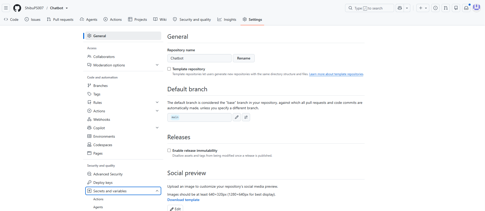
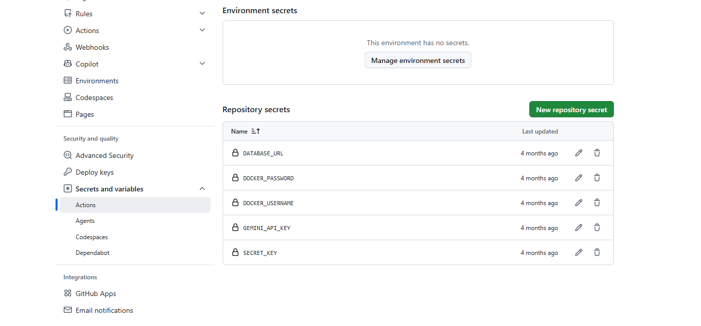

# CI Pipeline

## Overview

The CI pipeline runs automatically on every push to an feature branch validate code quality and security before changes are merged.

## Workflow

1. Checkout repository
2. Setup Python 3.12
3. Install dependencies
4. Run Ruff linting
5. Run Black formatting checks
6. Perform Bandit security scan
7. Detect exposed secrets
8. Audit dependencies for vulnerabilities
9. Execute automated tests

## Trigger

The workflow is triggered on:

- Push events

## Workflow File

`.github/workflows/ci-push.yml`

## storing secrets

 1) **Any secrets or api_key required for the project should be store in an secure location eg required for the testing or production purpose.**
    
 2) **It can be stored in github in the repo of the current project then go to settings of repo then to secrets and variable then to actions.**

